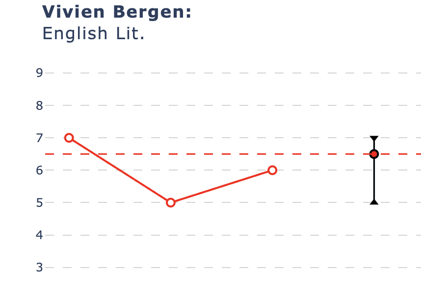
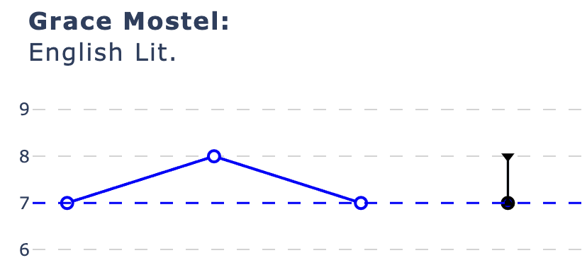
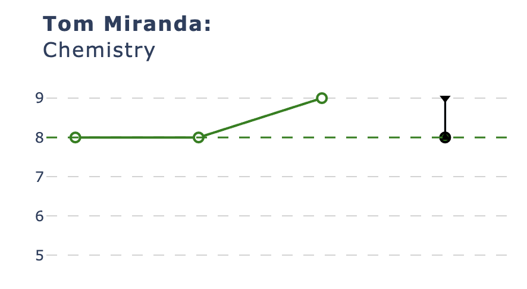
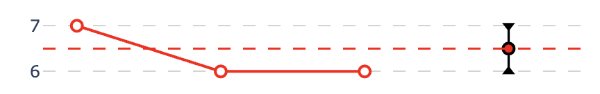

# tracking-data-proof-of-concept

## Contents
1. [Description](#description)
1. [Installation instructions](#installation-instructions)
1. [Usage instructions](#usage-instructions)
1. [File structure](#file-structure)
    - [Results App](#bootstrapped_resultspy)
    - [merged_yellis_diff_with_exams.csv](#merged_yellis_diff_with_examscsv)
1. [License information](#license-information)

## Description

This dashboard was built using Plotly and Dash to demonstrate how visualising attainment data for a cohort can lead to richer insights than the traditional review of a spreadsheet: particularly when looking at the overall distribution of data for a cohort rather than individual grades for individual students

Dummy data was generated in order to populate the dashboard - however this information often exists on spreadsheets or School MIS (Management Information System). The steps to create this data is not shown in this repository.

The dataset examines two rounds of 'mock' (practise) exams, the final GCSE exam outcome (end of secondary schooling exams in the UK at age 16) along with 'baseline' data. These are standardised tests that indicate a likely 'expected' grade for a given student based on their attainment on a standardised assessment (examples include YELLIS assessments)

## Installation instructions

See the requirements.txt file within the repository for the required modules.

Once installed, running the bootstrapped_results.py script from the terminal will provide an http link that you can copy and paste into a browser to review the output

running CTRL + C in the terminal will stop the script running when you want to finish

## Usage instructions

The below gif shows how, with a simple click, an educator can view the distribution of grades for each of these exam series

The dashboard showcases how interactivity can help to segement the data in an easy and intuitive manner. Hovering on a particular student populates a scatter graph that shows their progress across the exam series for that particular subject. This chart includes the following features:
- colour coding of the line to demonstrate whether a student met (blue), exceeded (green) or did not meet (red) their basline grade for that subject

- a reference line showing the baseline grade across the series - this is useful for indicating if performance increases throughout a course
- a range indicator showing what the maximum and minimum results are across the series for that student (and their comparison to the baseline data)

The gif below shows this chart updating dynamically upon changing the hovered datapoint on the boxplot.

Where a particular student is of interest (for example where their mock results for a subject are much higher than their final GCSE performance), <b>clicking</b> on a datapoint on the boxplot will bring up another scatter graph that shows the performance by that student across all of their subjects. This is useful for reviewing if they under/overpeformed their baseline across all subjects or particular subgroups of subjects.

## File structure

### bootstrapped_results.py 
This is the script that will run the dashboard when run from the terminal.

### merged_yellis_diff_with_exams.csv
This is a csv file of the data generated to showcase the dashboard - this was done separately in python but the steps to do so are not included within this repository

### requirements.txt
Lists the required modules for this project

## License information

None